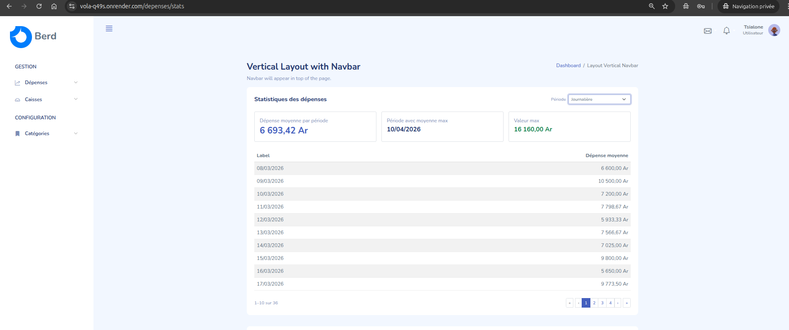
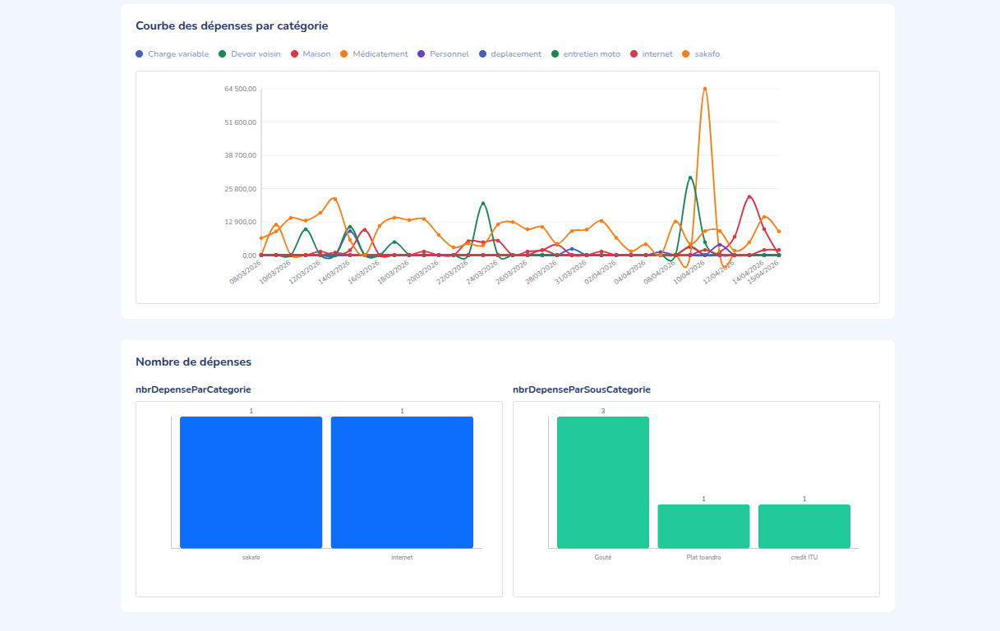
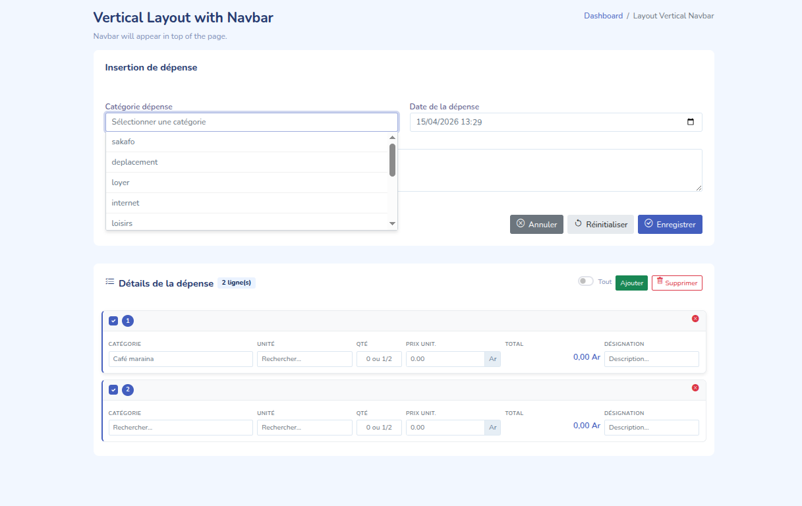
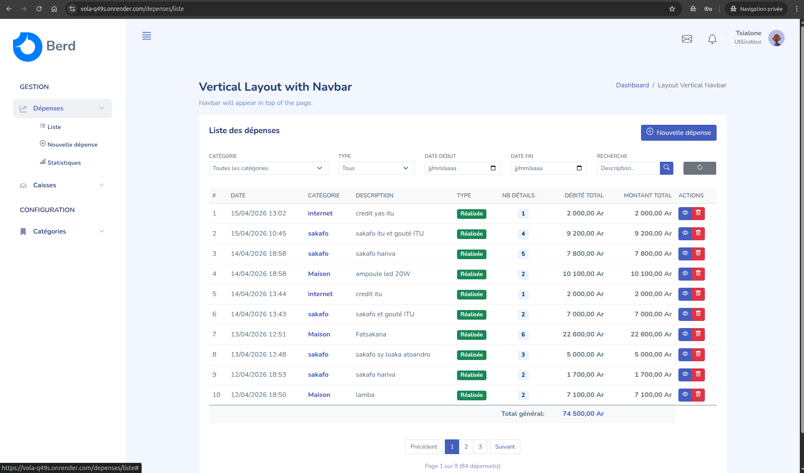
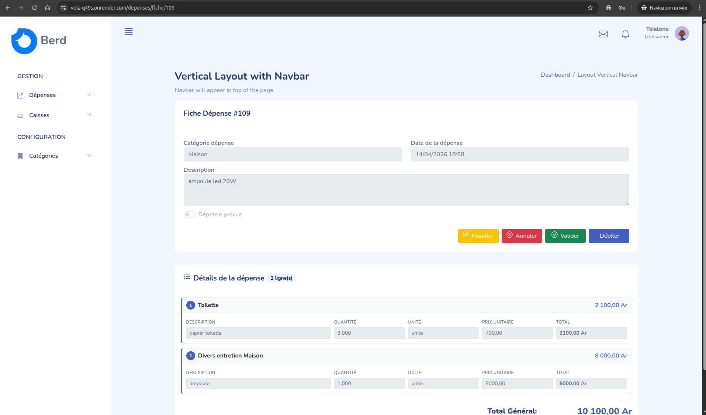
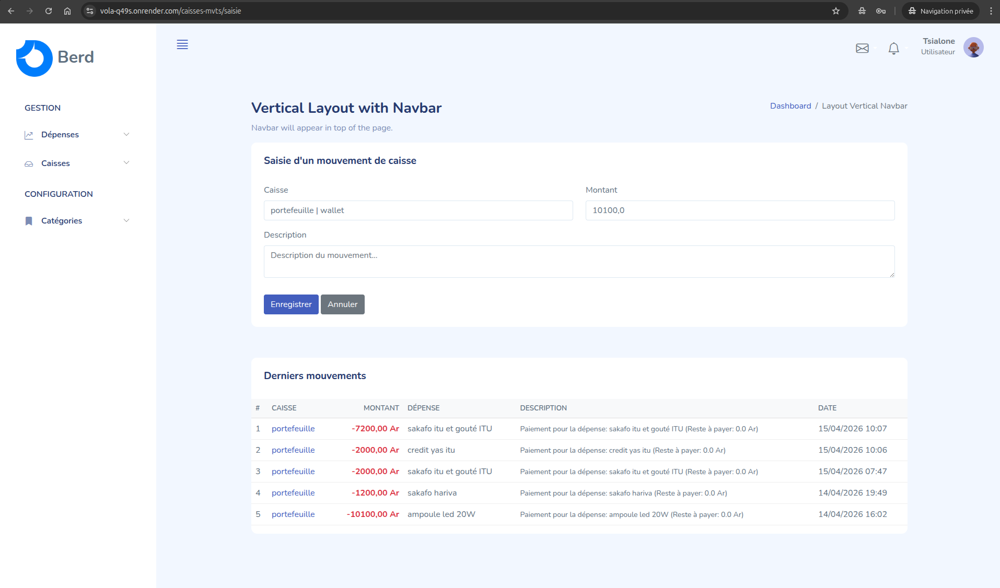
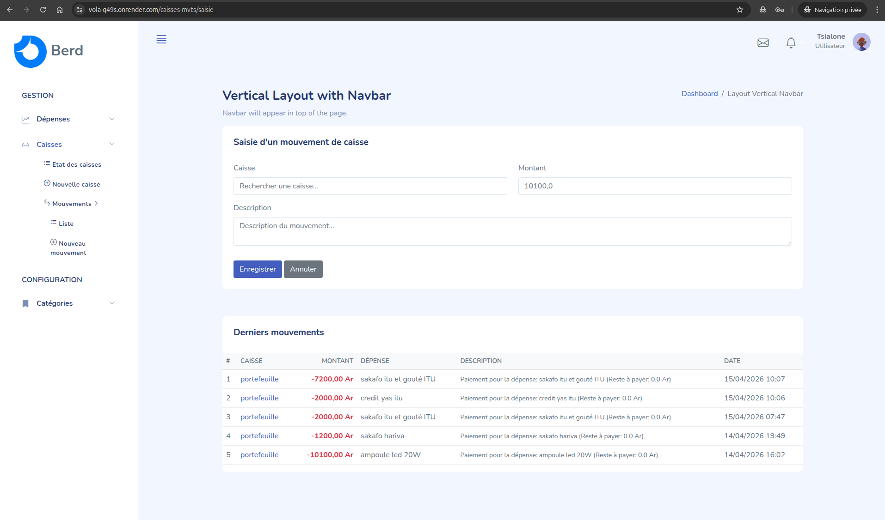
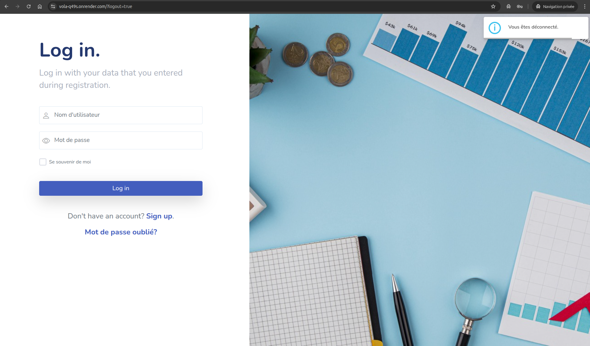

# VolAPP - Gestion Financière Personnelle

Une application web complète de gestion des dépenses et des caisses, développée avec Spring Boot et une interface graphique moderne. VolAPP vous permet de suivre vos dépenses, gérer vos caisses et analyser vos habitudes de consommation.

## Description

**VolAPP** est une plateforme de gestion financière qui offre :

- 🔐 Authentification sécurisée avec Spring Security
- 📊 Suivi détaillé des dépenses par catégorie
- 💰 Gestion de plusieurs caisses et mouvements
- 📈 Analyses statistiques et graphiques interactifs
- 📱 Interface utilisateur intuitive et responsive
- 🔄 Synchronisation multi-utilisateurs
- 🗄️ Base de données relationnelle robuste

## Structure du Projet

```
berd/
├── src/main/
│   ├── java/com/berd/dev/
│   │   ├── config/              # Configuration Spring
│   │   ├── controllers/         # Contrôleurs REST/Web
│   │   ├── dtos/               # Data Transfer Objects
│   │   ├── forms/              # Classes de formulaires
│   │   ├── interceptor/        # Intercepteurs HTTP
│   │   ├── mappers/            # Mappeurs DTOs
│   │   ├── models/             # Entités JPA
│   │   ├── repositories/       # Couche données
│   │   ├── services/           # Logique métier
│   │   ├── utils/              # Utilitaires
│   │   └── views/              # Support pour les vues
│   └── resources/
│       ├── templates/          # Templates Thymeleaf
│       │   ├── pages/         # Pages de l'application
│       │   ├── fragments/     # Fragments réutilisables
│       │   └── admin-layout.html
│       ├── static/            # Assets statiques
│       │   ├── css/
│       │   ├── js/
│       │   ├── images/
│       │   └── vendors/
│       └── application.properties
├── sql/                        # Scripts SQL d'initialisation
├── backup/                     # Sauvegardes base de données
├── docker-compose.yml         # Configuration Docker
├── pom.xml                    # Dépendances Maven
└── README.md
```

## Prérequis

- **Java** : JDK 11 ou supérieur
- **Maven** : 3.6.0 ou supérieur
- **PostgreSQL** : 12 ou supérieur
- **Docker** et **Docker Compose** (optionnel)
- **Git** : Pour le versioning

## Installation

### Option 1 : Avec Docker Compose (Recommandé)

```bash
# Cloner le repository
git clone <repository-url>
cd berd

# Lancer l'application et la base de données
docker compose up -d

# L'application sera accessible à http://localhost:8080
```

### Option 2 : Installation Locale

#### 1. Configurer la Base de Données

```bash
# Créer la base de données
psql -h localhost -U postgres -p 5432 -c "CREATE DATABASE berd_db;"

# Charger les données initiales
psql -h localhost -U postgres -p 5432 -d berd_db < sql/2026-03-05-init.sql
psql -h localhost -U postgres -p 5432 -d berd_db < sql/2026-03-06-data.sql
```

#### 2. Configurer l'Application

Éditer `src/main/resources/application.properties` :

```properties
spring.datasource.url=jdbc:postgresql://localhost:5432/berd_db
spring.datasource.username=postgres
spring.datasource.password=votre_mot_de_passe
spring.jpa.hibernate.ddl-auto=update
```

#### 3. Compiler et Lancer

```bash
# Compiler le projet
mvn clean install

# Lancer l'application
mvn spring-boot:run
```

L'application sera accessible à `http://localhost:8080`

## Utilisation

### Interface de Administration

Accédez au tableau de bord à : `http://localhost:8080`

### Accès à la Base de Données

```bash
# Connexion locale
psql -h localhost -U postgres -p 5432 -d berd_db

```

## Fonctionnalités Principales

### 1. Gestion des Dépenses

- ✅ Saisie des dépenses avec catégories
- ✅ Historique complet avec filtrage
- ✅ Statistiques par période (journalière, mensuelle, annuelle, hebdomadaire)
- ✅ Graphiques d'analyse tendances

### 2. Gestion des Caisses

- ✅ Création et gestion de plusieurs caisses
- ✅ Suivi des mouvements de caisse
- ✅ Catégorisation des mouvements
- ✅ Rapprochement bancaire

### 3. Sécurité et Authentification

- ✅ Inscription sécurisée
- ✅ Authentification par email/mot de passe
- ✅ Récupération de mot de passe oublié (via Brevo)
- ✅ Gestion des sessions utilisateurs
- ✅ Séparation des données par utilisateur
- ✅ Système d'envoi d'email transactionnel

### 4. Analyses et Rapports

- 📊 Graphiques interactifs (courbes, barres)
- 📈 Récapitulatifs dépenses par catégorie
- 📉 Tendances temporelles
- 🎯 KPIs personnalisés

### 5. Système d'Envoi d'Email

- ✅ Intégration **Brevo** pour l'envoi d'emails transactionnels
- ✅ Notifications d'inscription et confirmation
- ✅ Réinitialisation de mot de passe sécurisée
- ✅ Rapports et alertes par email
- ✅ Templates HTML personnalisables

## Galerie

#### Tableau de Bord pour les dépenses N°1


#### Tableau de Bord pour les dépenses N°2


#### Gestion des Dépenses N°1(stats_1)


#### Gestion des Dépenses N°2(stats_2)


#### Gestion des Dépenses N°3(liste)


#### Gestion des Dépenses N°5(fiche)


#### Gestion des Dépenses N°5(debité)


#### Gestion des Caisses N°1(etats des caisses)


#### Gestion des Caisses N°2(fiche d'une caisse)


#### Autres mouvements particuliers 


#### Authentification


## Modules Clés

### controllers/

Gère les requêtes HTTP et le routage :
- `DashboardController` - Tableau de bord
- `DepenseController` - Gestion des dépenses
- `CaisseController` - Gestion des caisses
- `AuthController` - Authentification

### services/

Logique métier de l'application :
- `DepenseService` - Services dépenses
- `CaisseService` - Services caisses
- `UserService` - Gestion utilisateurs
- `StatisticsService` - Calculs statistiques

### models/

Entités JPA :
- `User` - Utilisateurs
- `Depense` - Dépenses
- `CategoriDepense` - Catégories
- `Caisse` - Caisses de trésorerie
- `CaisseMvt` - Mouvements de caisse

### repositories/

Accès aux données :
- `UserRepository`
- `DepenseRepository`
- `CaisseRepository`
- `CaisseCategoriRepository`


## Branches de Développement

- `main` - Branche principale stable
- `feat/client-saisie` - Optimisation interface saisie
- `feat/*` - Nouvelles fonctionnalités

Pour contribuer :
1. Créer une branche `feat/votre-feature`
2. Commiter vos changements
3. Faire un Pull Request vers `main`

## Configuration

### Variables d'Environnement

```bash
# Base de données
DB_HOST=localhost
DB_PORT=5432
DB_NAME=berd_db
DB_USER=postgres
DB_PASSWORD=votre_mot_de_passe

# Application
APP_PORT=8080
APP_ENV=development
```

### Fichiers de Configuration

- `src/main/resources/application.properties` - Configuration Spring
- `docker-compose.yml` - Configuration des services
- `pom.xml` - Dépendances Maven

## Dépendances Principales

- **Spring Boot** - Framework web
- **Spring Security** - Authentification/autorisation
- **Spring Data JPA** - Accès aux données
- **Thymeleaf** - Templating
- **PostgreSQL Driver** - Connecteur base de données
- **Bootstrap** - Framework CSS
- **ApexCharts** - Graphiques interactifs


## Notes de Développement

- L'application utilise JPA/Hibernate pour l'ORM
- Thymeleaf est utilisé pour le rendu côté serveur
- Spring Security gère l'authentification
- Les données sont isolées par utilisateur
- Bootstrap 5 pour le design responsive

## Auteur

Projet développé par **Tsialone**

## License

Open Source

---

**Bon développement ! 🚀**
